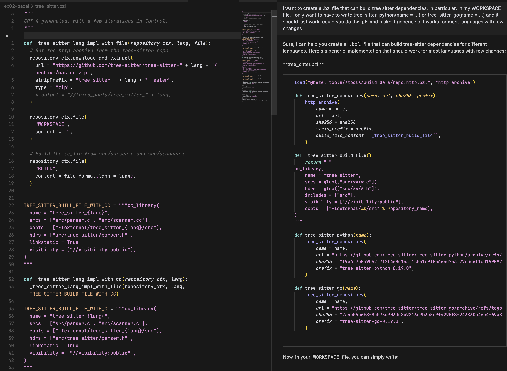

## Bazel generation for tree-sitter

Scenario:


#### Steps

1. Ask GPT-4 the following: 

```
i want to create a .bzl file that can build tree sitter dependencies. in particular, in my WORKSPACE file, i only want to have to write tree_sitter_python(name = ...) or tree_sitter_go(name = ...) and it should just work. could you do this pls and make it generic so it works for most languages with few changes
```

2. Follow up with "now do it for rust, typescript, javascript too"

3. Paste the output of `bazel test //...` and ask GPT-4 to fix the bugs.

4. You're done. Somewhat esoteric Bazel code, in 2 minutes.


#### Screenshots

The initial prompt:



The final file: [tree_sitter.bzl](tree_sitter.bzl). GPT-4-generated, in a few iterations with access to build errors.