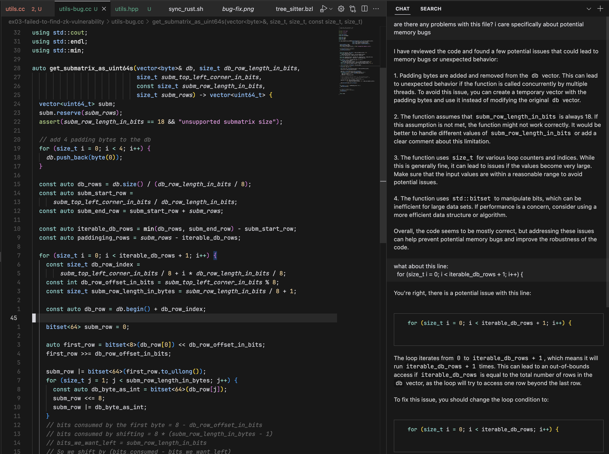

## Raw model fails to find memory bug

Scenario: You want to find memory bugs in your C++ code. Here, `utils.cc` is our correct code, and in `utils-bug.cc` we have introduced a bug on line 38 where we make the for loop do one iteration too many.

#### Steps

1. Prompt GPT-4 with the `utils-bug.cc` file and ask it if there are any memory problems.
2. It fails to find it!
3. If we ask about the specific line, it is able to find it.

GPT-4 is not the be-all and end-all of coding tools. You need to combine its powers with traditional tools — address sanitizers, static analyzers, and more.

#### Screenshots

