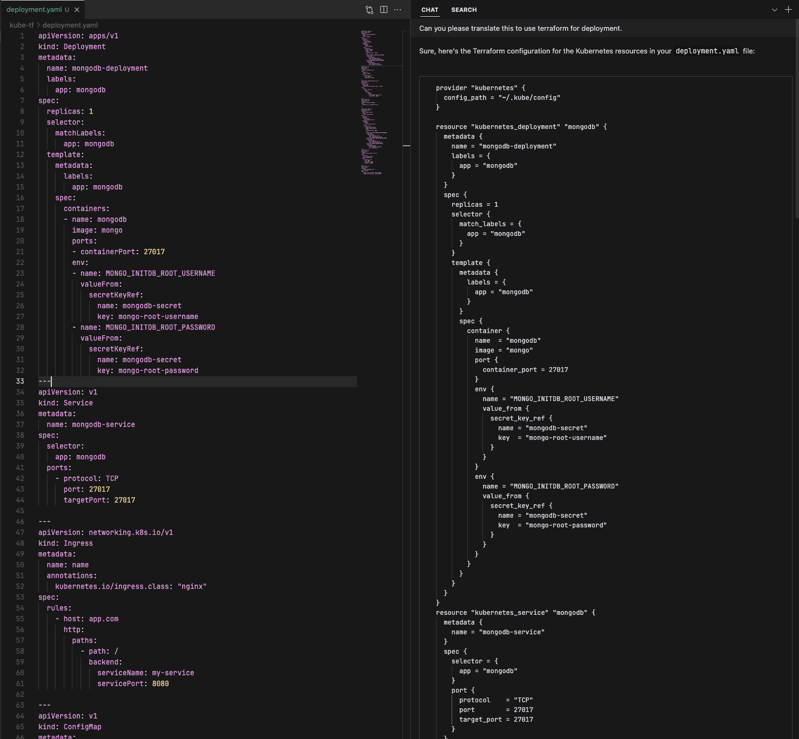

## Generate Terraform files from Kube YAMLs

Scenario: You have Kube YAMLs. You want to use Terraform instead. Why should you write the code? Just let the model do it.

#### Steps

1. Prompt GPT-4 with "Can you please translate this to use terraform for deployment" including the `deployment.yaml` file.
2. That's it. The generated `deployment.tf` file just works.

#### Screenshots

The generation:

