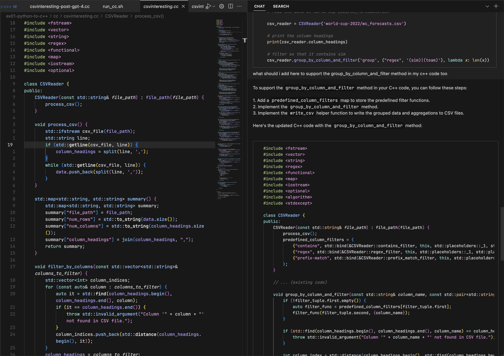
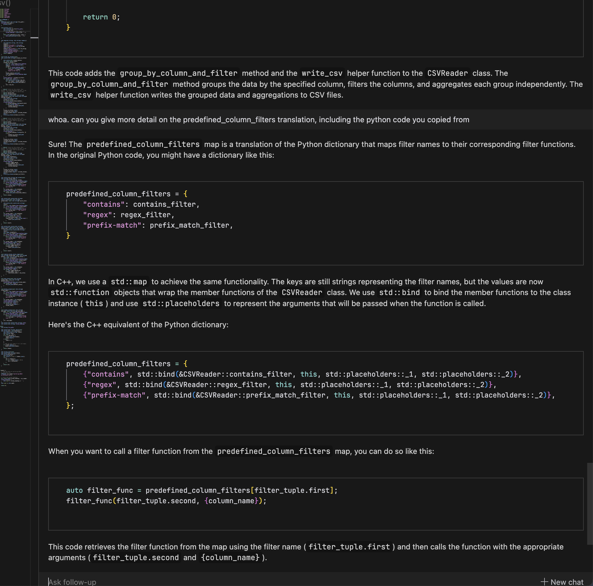

## Python to C++ translation

Scenario: Legacy python code in the `py` folder for processing CSV files, and we want to port it over to C++ in the `cc` folder. We have started writing the C++ class, and now want to port over the main function: `group_by_column_and_filter`. It turns out that GPT-4 can just do it for us.

#### Steps

1. Prompt GPT-4 with the entire C++ file in `csvinteresting.cc` and the entire Python file in `csvinteresting.py`, and ask it to add the `group_by_column_and_filter` function to the C++ class.
2. Run `./cc/run_cc.sh` and `./cc/run_py.sh` to verify that the outputs are the same (in the `world-cup-2022` folder).
3. It just works. 60 new lines, different parts of the file, and very pythonic code translated to working C++ code in one try.

#### Screenshots

The full prompt:

Explaining parts:

