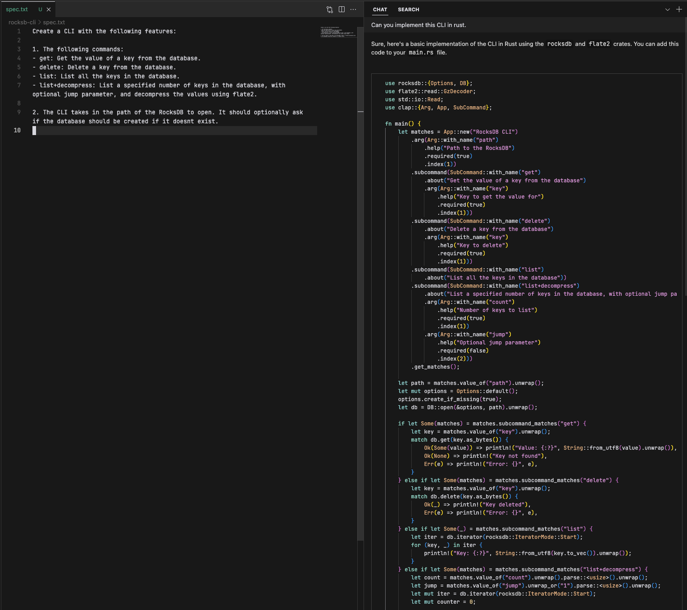
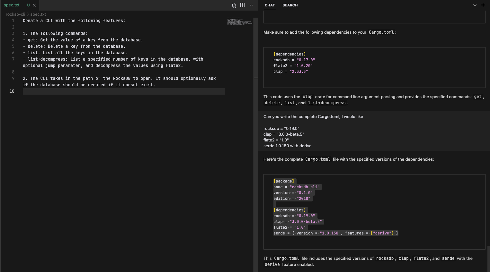
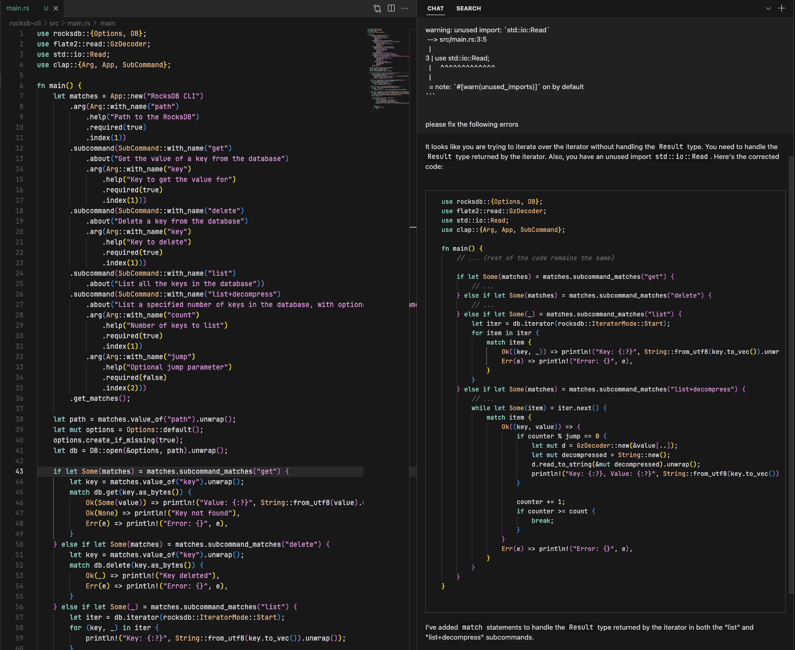

# Creating a CLI instantly

Scenario: You have a RocksDB database, and you want to generate a CLI for it.

#### Steps

1. Prompt GPT-4 with the `spec.txt` and "Can you implement this in Rust".
2. Generate the Cargo.toml.
3. Fix a bug by giving GPT-4 the error message.
4. You have a CLI.

#### Screenshots

Initial prompt:

Generating the Cargo.toml:

Fixing the last bug:

